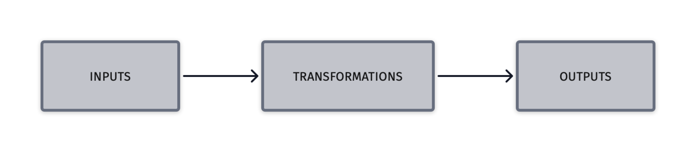

# Introduction

::: info
This is a practical guide on how to publish data as Linked Data Event Stream (LDES).
:::

A [Linked Data Event Stream](https://semiceu.github.io/LinkedDataEventStreams/) is a collection of immutable versioned objects. Every occurrence of an object represents the momentary state of an object. An object may appear several times in a stream. LDES streams are immutable and so whenever an object is updated, the change must be appended to the stream.

Objects in the LDES stream are described in their [RDF](https://www.w3.org/RDF/) ([Notion3](https://www.w3.org/TeamSubmission/n3/)) form. This means that the LDES stream contains not only the raw data, but also associated semantic and ontology information which link back to the origin of the data.

For example, an object like this:

```json
{
  "id": "urn:ngsi-v2:cot-imec-be:Device:imec-iow-DR7drcZ49ZBTJHayVVJpR1",
  "observedAt": "2023-05-12T11:52:37.412Z",
  "healthState": "up"
}
```

Can be represented as follows in LDES member:

```
@prefix default-context: <https://uri.etsi.org/ngsi-ld/default-context/> .
@prefix ldes:            <https://w3id.org/ldes#> .
@prefix ngsi-ld:         <https://uri.etsi.org/ngsi-ld/> .
@prefix prov:            <http://www.w3.org/ns/prov#> .
@prefix rdf:             <http://www.w3.org/1999/02/22-rdf-syntax-ns#> .
@prefix terms:           <http://purl.org/dc/terms/> .
@prefix tree:            <https://w3id.org/tree#> .


<urn:ngsi-v2:cot-imec-be:Device:imec-iow-DR7drcZ49ZBTJHayVVJpR1/2023-05-12T11:52:37.412Z>
        rdf:type                        default-context:Device ;
        terms:isVersionOf               <urn:ngsi-v2:cot-imec-be:Device:imec-iow-DR7drcZ49ZBTJHayVVJpR1> ;
        prov:generatedAtTime            "2023-05-12T11:52:37.412Z"^^<http://www.w3.org/2001/XMLSchema#dateTime> ;

        default-context:healthState     [ rdf:type          ngsi-ld:Property ;
                                          ngsi-ld:hasValue  "up"
                                        ] ;
```

If this object changes state (for example, the `healthState` property changes to `down`), the updated object will be appended to the stream:

```
@prefix default-context: <https://uri.etsi.org/ngsi-ld/default-context/> .
@prefix ldes:            <https://w3id.org/ldes#> .
@prefix ngsi-ld:         <https://uri.etsi.org/ngsi-ld/> .
@prefix prov:            <http://www.w3.org/ns/prov#> .
@prefix rdf:             <http://www.w3.org/1999/02/22-rdf-syntax-ns#> .
@prefix terms:           <http://purl.org/dc/terms/> .
@prefix tree:            <https://w3id.org/tree#> .


<urn:ngsi-v2:cot-imec-be:Device:imec-iow-DR7drcZ49ZBTJHayVVJpR1/2023-05-12T11:52:37.412Z>
        rdf:type                        default-context:Device ;
        terms:isVersionOf               <urn:ngsi-v2:cot-imec-be:Device:imec-iow-DR7drcZ49ZBTJHayVVJpR1> ;
        prov:generatedAtTime            "2023-05-12T11:52:37.412Z"^^<http://www.w3.org/2001/XMLSchema#dateTime> ;

        default-context:healthState     [ rdf:type          ngsi-ld:Property ;
                                          ngsi-ld:hasValue  "up"
                                        ] ;

<urn:ngsi-v2:cot-imec-be:Device:imec-iow-DR7drcZ49ZBTJHayVVJpR1/2023-05-12T12:30:37.412Z>
        rdf:type                        default-context:Device ;
        terms:isVersionOf               <urn:ngsi-v2:cot-imec-be:Device:imec-iow-DR7drcZ49ZBTJHayVVJpR1> ;
        prov:generatedAtTime            "2023-05-12T12:30:37.412Z"^^<http://www.w3.org/2001/XMLSchema#dateTime> ;

        default-context:healthState     [ rdf:type          ngsi-ld:Property ;
                                          ngsi-ld:hasValue  "down"
                                        ] ;
```

::: info
LDES uses the N-Triples notation for RDF data. This is a compact and readable alternative to RDF XML.
:::

## Overview

On a higher level, the process of transforming the data consists of the following steps:

- Identify data to be mapped
  - Which datasets will be converted
  - Establish the origin of the data - access rights and metadata
- Discover or create ontologies describing the data
  - At the very least, metadata needed to describe each value types
  - Domain-specific data model e.g. [OSLO](https://www.vlaanderen.be/digitaal-vlaanderen/onze-oplossingen/oslo)
- Transform raw data to **linked data**
  - Associate models and ontologies with the data
  - Create the final shape of what will be made part of the LDES stream (e.g. fields may be omitted or transformed)
- Transform and store as **LDES**
  - TODO: Apply versioning ...
  - TODO: The tree spec is ongoing, it's a graph actually (https://github.com/TREEcg/specification)
- Make the data available to consumers using [LDES Server](https://informatievlaanderen.github.io/VSDS-Tech-Docs/docs/LDES_server.html)
  - Select the appropriate views and fragmentations for publishing
  - TODO: What does the LDES Server do (only makes fragmentations)

## Transforming data to linked data

We have a number of VSDS components available to facilitate the onboarding and transformation of raw data into LDES. They're collectively known as the [LDI bundle](https://github.com/Informatievlaanderen/VSDS-Linked-Data-Interactions).

::: info
Linked Data Interactions Repo (LDI) is a bundle of basic components used to receive, generate, transform and output Linked Data.
:::

The LDI project is an effort to make interactions with Linked Data more fluently by providing easy building blocks.

To allow a dataset to be published as LDES, we can use the LDI workbench to transform the original messages to linked data version objects with a specific ontology. These objects are then sent to a LDES Server to ingest, store make available to LDES Client consumers.

The LDI suite of components can achieve this goal:

- Input of data - receive or scrape a remote HTTP endpoint
- Transformation - map the data to a specific ontology, apply various transformations
- Publishing - submit to a preconfigured LDES Server



While there are multiple ways to handle the mapping of the input data, in this guide, we will focus on using the RML tool.

::: info
The [RMLMapper](https://github.com/RMLio/rmlmapper-java) and the [RMLStreamer](https://github.com/RMLio/RMLStreamer) are applications for Linux, Windows, and macOS machines for generating knowledge graphs. They both rely on [declarative rules](https://rml.io/#rules) that define how the knowledge graphs are generated. Get started immediately by following the instructions on their Github repositories.
:::

## Getting started with scraping an HTTP endpoint

### Example

A ready-to-use example is available at [Scrape HTTP Example](https://informatievlaanderen.github.io/VSDS-Linked-Data-Interactions/ldio/examples/ex2-scrape-api)

### Resources

- LDI Home [https://informatievlaanderen.github.io/VSDS-Linked-Data-Interactions/](https://informatievlaanderen.github.io/VSDS-Linked-Data-Interactions/)

* RML Mapper [https://github.com/RMLio/rmlmapper-java](https://github.com/RMLio/rmlmapper-java)
* RML Mapping Rules & Examples [https://github.com/RMLio/RML-LDES-mapping-rules](https://github.com/RMLio/RML-LDES-mapping-rules)
* YARRRML Extension [https://github.com/RMLio/yarrrml-ldes-extension](https://github.com/RMLio/yarrrml-ldes-extension)
* YARRRML Matey Editor [https://rml.io/yarrrml/matey/](https://rml.io/yarrrml/matey/)

- More about serving [LDES](https://informatievlaanderen.github.io/VSDS-Tech-Docs/docs/Introduction.html)
- TBD: https://github.com/Informatievlaanderen/VSDS-Onboarding-CrowdScan/blob/main/architecture/README.md
- TBD: ... https://github.com/Informatievlaanderen/VSDS-LDES-E2E-testing/tree/main/tests/033.archiving

## Using RML

TODO
