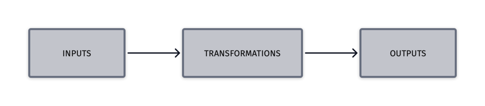

# Transforming data

On a higher level, the process of transforming the data consists of the following steps:

## Identify Data to be published

As a first step, one needs to clearly identify the datasets to be published as LDES.

- Establish the origin of the data
- Establish the parameters for storing and using the data

## Discover or create ontologies describing the data

This process usually depends on the type of data being exposed. In order to publish a dataset in the form of LDES, the data must be semantically described using one or more data models.

The value of publishing data sets through LDES lies in the easy interlinking of data between companies and organizations over the Web. Selecting the correct model to describe the data, as well as reusing the same model to describe the same kind of data is one of the means to facilitate client consumers.

An example of a domain-specific model describing sensors, measurements and observations is [OSLO](https://www.vlaanderen.be/digitaal-vlaanderen/onze-oplossingen/oslo).

- Data is openly available in a predefined format

- The format is structured and non-proprietary

- The format follows [W3C](https://en.wikipedia.org/wiki/World_Wide_Web_Consortium) standards using [RDF](https://en.wikipedia.org/wiki/Resource_Description_Framework) and [URIs](https://en.wikipedia.org/wiki/Uniform_Resource_Identifier)

- The format links to other related objects to provide context (e.g. an Observation links to a Sensor or a Location).

## Transforming data to linked data

We have a number of VSDS components available to facilitate the onboarding and transformation of raw data into LDES. They're collectively known as the [LDI bundle](https://github.com/Informatievlaanderen/VSDS-Linked-Data-Interactions).

::: info
Linked Data Interactions Repo (LDI) is a bundle of basic components used to receive, generate, transform and output Linked Data.
:::

The LDI project is an effort to make interactions with Linked Data more fluently by providing easy building blocks.

To allow a dataset to be published as LDES, we can use the LDI workbench to transform the original messages to linked data version objects with a specific ontology. These objects are then sent to a LDES Server to ingest, store make available to LDES Client consumers.

The LDI suite of components can achieve this goal:

- Input of data - receive or scrape a remote HTTP endpoint
- Transformation - map the data to a specific ontology, apply various transformations
- Publishing - submit to a preconfigured LDES Server

While there are multiple ways to handle the mapping of the input data, in this guide, we will focus on using the RML tool.

::: info
The [RMLMapper](https://github.com/RMLio/rmlmapper-java) and the [RMLStreamer](https://github.com/RMLio/RMLStreamer) are applications for Linux, Windows, and macOS machines for generating knowledge graphs. They both rely on [declarative rules](https://rml.io/#rules) that define how the knowledge graphs are generated. Get started immediately by following the instructions on their Github repositories.
:::

## Getting started with scraping an HTTP endpoint

### Example

A ready-to-use example is available at [Scrape HTTP Example](https://informatievlaanderen.github.io/VSDS-Linked-Data-Interactions/ldio/examples/ex2-scrape-api)

### Resources

- LDI Home [https://informatievlaanderen.github.io/VSDS-Linked-Data-Interactions/](https://informatievlaanderen.github.io/VSDS-Linked-Data-Interactions/)

* RML Mapper [https://github.com/RMLio/rmlmapper-java](https://github.com/RMLio/rmlmapper-java)
* RML Mapping Rules & Examples [https://github.com/RMLio/RML-LDES-mapping-rules](https://github.com/RMLio/RML-LDES-mapping-rules)
* YARRRML Extension [https://github.com/RMLio/yarrrml-ldes-extension](https://github.com/RMLio/yarrrml-ldes-extension)
* YARRRML Matey Editor [https://rml.io/yarrrml/matey/](https://rml.io/yarrrml/matey/)

- More about serving [LDES](https://informatievlaanderen.github.io/VSDS-Tech-Docs/docs/Introduction.html)
